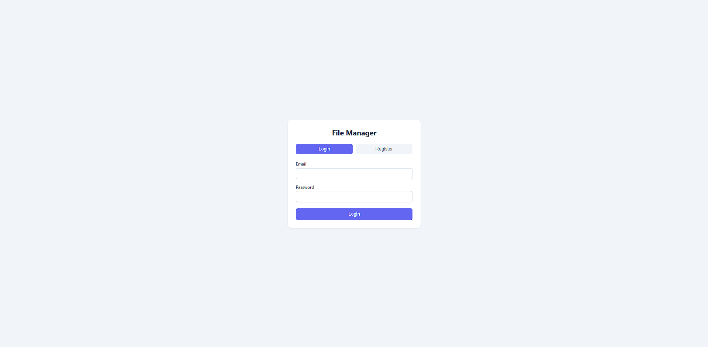
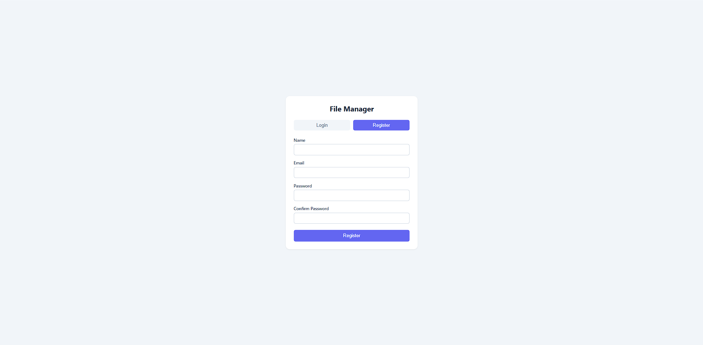
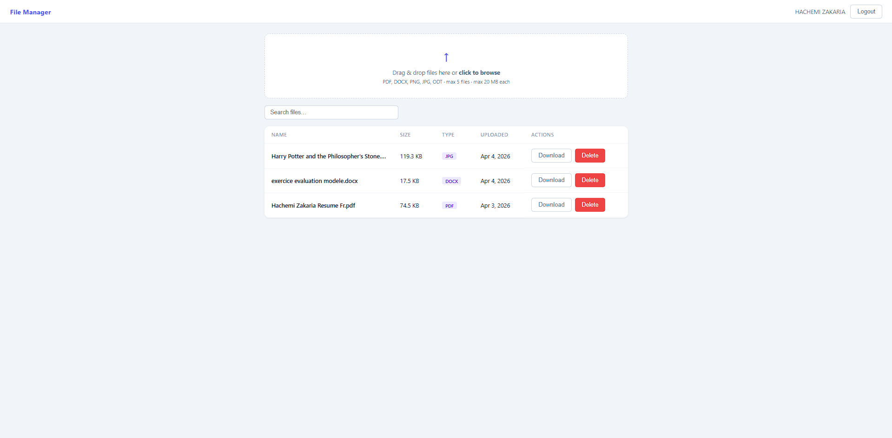

# File Manager

A full-stack file management application that allows users to securely upload, browse, download, and delete files. Built with a Laravel REST API backend and a Vue 3 single-page frontend.

---

## Screenshots

**Login**



**Register**



**File Manager**



---

## Architecture

### Backend — Laravel 11 (REST API)

| Choice | Reason |
|--------|--------|
| **Laravel 11** | Provides routing, validation, Eloquent ORM, and file storage out of the box, reducing boilerplate for a REST API |
| **Laravel Sanctum** | Lightweight token-based authentication suited for SPA + API setups without the overhead of OAuth |
| **SQLite** | Zero-configuration database that fits a single-user or small-scale file manager — no separate DB server needed |
| **Local private disk** | Uploaded files are stored in `storage/app/private/uploads/` outside the public directory, preventing direct URL access |
| **Per-user file isolation** | Files are stored under a subdirectory named after the user's ID, so each user only ever accesses their own files |

### Frontend — Vue 3 + Vite

| Choice | Reason |
|--------|--------|
| **Vue 3 (Composition API)** | Reactive, component-based UI with a small bundle size and fast dev iteration via Vite |
| **Pinia** | Official Vue state management — handles auth token persistence (`localStorage`) and the file list state |
| **Vue Router** | Client-side routing with navigation guards that redirect unauthenticated users to the login page |
| **Axios** | HTTP client with a request interceptor that automatically attaches the Bearer token to every API call |

### Docker

The app runs as two containers behind a shared network:

```
Browser → nginx:8000 → PHP-FPM (app:9000)
```

- **nginx** serves as the reverse proxy and forwards `.php` requests to the `app` container via FastCGI
- **app** runs PHP-FPM 8.2, installs Composer dependencies at build time, and runs migrations on startup
- No database container is needed — SQLite lives inside the `app` container's volume

---

## Project Structure

```
.
├── backend/                  # Laravel 11 API
│   ├── app/
│   │   ├── Http/
│   │   │   ├── Controllers/  # AuthController, FileController
│   │   │   └── Requests/     # FileUploadRequest (validation)
│   │   └── Models/           # User, File
│   ├── database/
│   │   └── migrations/       # users, files, tokens tables
│   ├── routes/
│   │   └── api.php           # All API endpoints
│   ├── storage/app/private/  # Uploaded files (gitignored)
│   ├── docker/
│   │   ├── entrypoint.sh     # Key generation + migrations on start
│   │   └── nginx/
│   │       └── default.conf  # Nginx → PHP-FPM config
│   └── Dockerfile
├── frontend/                 # Vue 3 + Vite SPA
│   └── src/
│       ├── api/              # Axios instance
│       ├── components/       # NavBar, FileList, FileRow, FileUploadZone, Pagination, DeleteConfirmModal
│       ├── router/           # Vue Router with auth guards
│       ├── stores/           # Pinia stores (auth, files)
│       └── views/            # LoginView, FilesView
├── docker-compose.yml
└── .gitignore
```

---

## Setup

### Option 1 — Docker (recommended)

**Requirements:** Docker & Docker Compose

```bash
# 1. Clone the repository
git clone <repo-url>
cd "File Management System"

# 2. Start the backend
docker-compose up --build
```

The API will be available at `http://localhost:8000/api`.

> On first run the entrypoint automatically generates the app key and runs all migrations.

---

### Option 2 — Manual

**Requirements:** PHP 8.2+, Composer, Node.js 18+

#### Backend

```bash
cd backend

# Install dependencies
composer install

# Set up environment
cp .env.example .env
php artisan key:generate

# Create the SQLite database and run migrations
touch database/database.sqlite
php artisan migrate

# Start the dev server
php artisan serve
```

The API will be available at `http://localhost:8000`.

#### Frontend

```bash
cd frontend

# Install dependencies
npm install

# Start the dev server
npm run dev
```

The app will be available at `http://localhost:5173`.

---

## API Endpoints

| Method | Endpoint | Auth | Description |
|--------|----------|------|-------------|
| `POST` | `/api/register` | No | Create a new account |
| `POST` | `/api/login` | No | Login and receive a token |
| `POST` | `/api/logout` | Yes | Revoke the current token |
| `GET` | `/api/files` | Yes | List the authenticated user's files |
| `POST` | `/api/files` | Yes | Upload a file |
| `GET` | `/api/files/{id}/download` | Yes | Download a file |
| `DELETE` | `/api/files/{id}` | Yes | Delete a file |
